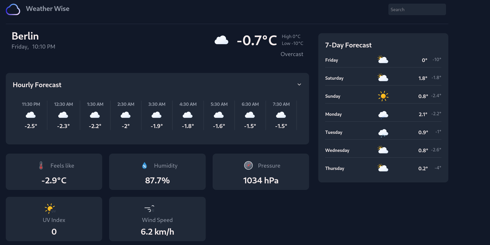

# Weather App



A weather application that displays current, daily, and hourly weather information.

## Setup

1. Clone the repository
2. Install dependencies:

   ```bash
   npm install
   ```

3. Create a `.env` file in the root directory (copy from `.env.example`):

   ```bash
   cp .env.example .env
   ```

4. Get your API key from [Visual Crossing Weather](https://www.visualcrossing.com/) and add it to your `.env` file:

   ```
   WEATHER_API_KEY=api_key
   ```

5. Run the development server:
   ```bash
   npm run dev
   ```

## Environment Variables

- `WEATHER_API_KEY` - Your Visual Crossing Weather API key (required)
